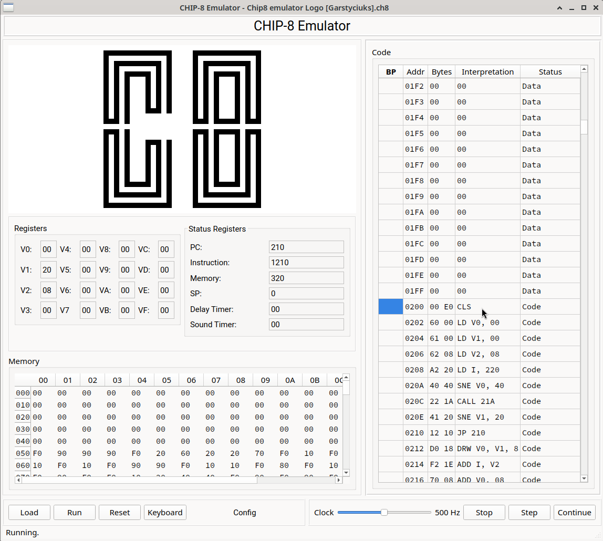

#Chip-8 documentation

An emulator for the CHIP-8 virtual machine written in Python using PYQT.

## Table of Contents

- [Design Rationale](#rationale)
- [Chip-8 Introduction](#introduction)
- [Supported Features](#features)
- [Dependencies](#dependencies)
- [Op-code Description](#op-codes)
- [GUI Description](#gui-description)
- [External Links](#links)

## Design Rationale

-   **QT-GUI** for simple use. Provides direct visual feedback during program 
    execution (graphics and disassembler), allows single step and adjusting the
    clock frequency.
-   **Separation of GUI and emulation engine**. Perephrial devices like display
    or keyboard are abstracted to enhance reusability.
-   **Emulator engine unit tested**
-   **Original** the emulator tries to stay as close as possible to the original
    COSMAC version of CHIP-8. No enxtensions or improvements are implemented. Original
    behaviour has always been preferred over convenience or safety. 
-   **Performance** After every instruction the emulator and the GUI are in sync. This 
    was a deliberate design decision and has impact on the performance. This is NOT
    a gaming console!
    

## Chip-8 Introduction

From Wikipedia, the free encyclopedia
CHIP-8 is an interpreted programming language, developed by Joseph Weisbecker
on his 1802 microprocessor. It was initially used on the COSMAC VIP and Telmac
1800, which were 8-bit microcomputers made in the mid-1970s.

CHIP-8 was designed to use less memory than other programming languages like 
BASIC, while still being easier to program than machine code.[1] The language 
looks like machine code as it uses hexadecimal codes for instructions, but as 
an interpreter, like BASIC, it does not need to be assembled or linked before 
running.

CHIP-8 interpreters have since been made for many devices, such as home 
computers, microcomputers, graphing calculators, mobile phones, and video game 
consoles

## Supported Features

This version tries to emulate the original COSMAC design as close as possible without
implementing any later extensions. 

- **Display** The original 64x32 pixel monochrome display
- **Leyboard** Supports the 4x4 Chip8 keyboard. Keys can be re-mapped easily.
- **Realtime Register Display** The contents of all Chip8 registers (V0-VF, PC, I, SP,
delay timer, sound timer) are displayd in realtime, i.e. after executing one instruction, 
the GUI and the internal state of the machine are in sync.
- **Debugging** The emulator allows for interrupting, single stepping through the program
and resuming realtime execution. A rudimetary disassembler is available. It shows the 
program as assembler listing and the current instruction high lighted.

## Dependencies

For the complete development envirionment:
- cmake
- Doxygen
- Python>=3.12
- PyQt6>=6.7
- pyqt6.qtmultimedia

For the testing phase, add separate dependencies containing:
- pytest>=8.0
- pytest-qt
- ruff
- mypy

## Op-code Description

- **00E0**	clear the screen, in XO-CHIP only selected bit planes are cleared, in MegaChip mode it updates the visible screen before clearing the draw buffer
- **00EE**	return from subroutine to address pulled from stack
- **0nnn**	jump to native assembler subroutine at 0xNNN
- **1nnn**	jump to address NNN
- **2nnn**	push return address onto stack and call subroutine at address NNN
- **3xnn**	skip next opcode if vX == NN (note: on platforms that have 4 byte opcodes, like F000 on XO-CHIP, this needs to skip four bytes)
- **4xnn**	skip next opcode if vX != NN (note: on platforms that have 4 byte opcodes, like F000 on XO-CHIP, this needs to skip four bytes)
- **5xy0**	skip next opcode if vX == vY (note: on platforms that have 4 byte opcodes, like F000 on XO-CHIP, this needs to skip four bytes)
- **6xnn**	set vX to NN
- **7xnn**	add NN to vX
- **8xy0**	set vX to the value of vY
- **8xy1**	set vX to the result of bitwise vX OR vY
- **8xy2**	set vX to the result of bitwise vX AND vY
- **8xy3**	set vX to the result of bitwise vX XOR vY
- **8xy4**	add vY to vX, vF is set to 1 if an overflow happened, to 0 if not, even if X=F!
- **8xy5**	subtract vY from vX, vF is set to 0 if an underflow happened, to 1 if not, even if X=F!
- **8xy6**	set vX to vY and shift vX one bit to the right, set vF to the bit shifted out, even if X=F!
- **8xy7**	set vX to the result of subtracting vX from vY, vF is set to 0 if an underflow happened, to 1 if not, even if X=F!
- **8xyE**	set vX to vY and shift vX one bit to the left, set vF to the bit shifted out, even if X=F!
- **9xy0**	skip next opcode if vX != vY (note: on platforms that have 4 byte opcodes, like F000 on XO-CHIP, this needs to skip four bytes)
- **Annn**	set I to NNN
- **Bnnn**	jump to address NNN + v0
- **Cxnn**	set vx to a random value masked (bitwise AND) with NN
- **Dxyn**	draw 8xN pixel sprite at position vX, vY with data starting at the address in I, I is not changed
- **Ex9E**	skip next opcode if key in the lower 4 bits of vX is pressed (note: on platforms that have 4 byte opcodes, like F000 on XO-CHIP, this needs to skip four bytes)
- **ExA1**	skip next opcode if key in the lower 4 bits of vX is not pressed (note: on platforms that have 4 byte opcodes, like F000 on XO-CHIP, this needs to skip four bytes)
- **Fx07**	set vX to the value of the delay timer
- **Fx0A**	wait for a key pressed and released and set vX to it, in megachip mode it also updates the screen like clear
- **Fx15**	set delay timer to vX
- **Fx18**	set sound timer to vX, sound is played as long as the sound timer reaches zero
- **Fx1E**	add vX to I
- **Fx29**	set I to the 5 line high hex sprite for the lowest nibble in vX
- **Fx33**	write the value of vX as BCD value at the addresses I, I+1 and I+2
- **Fx55**	write the content of v0 to vX at the memory pointed to by I, I is incremented by X+1
- **Fx65**	read the bytes from memory pointed to by I into the registers v0 to vX, I is incremented by X+1

## GUI Description

## External Links

1) [Wikipedia](https://en.wikipedia.org/wiki/CHIP-8)

2) [CHIP-8 Variant Opcode Table](https://chip8.gulrak.net)
